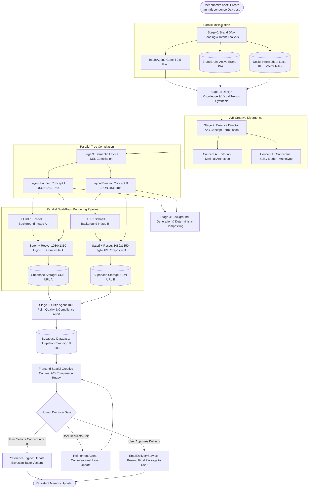
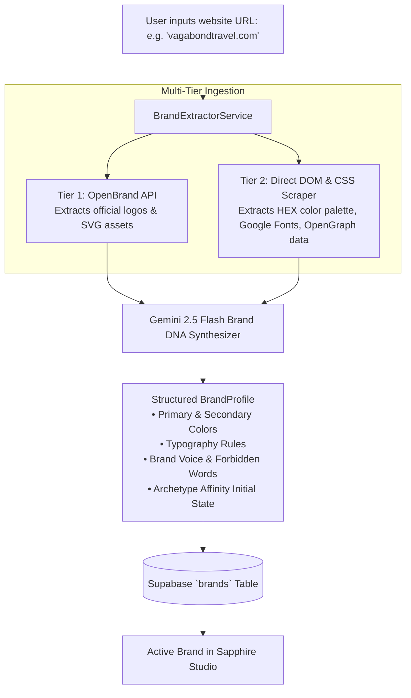

# Sapphire — Master Architecture, Codebase Audit & System Specification

> **Document Version:** 2.0 (Post-Scan System Audit)  
> **Repository:** `sapphire-v2`  
> **Primary Location:** [`documents/MASTER_ARCHITECTURE_AND_CODEBASE_AUDIT.md`](file:///c:/Users/USER/Documents/Builds/sapphire-v2/documents/MASTER_ARCHITECTURE_AND_CODEBASE_AUDIT.md)  
> **Core Architectural Paradigm:** Dual-Brain Semantic Design Engine (Reasoning + Deterministic Box Model)  
> **Execution Environment:** Next.js App Router (React 19) • Mastra DAG Orchestration • Vercel Serverless Free-Tier Compatible  
> **Authoritative Compliance:** Fully aligned with [`AGENTS.md`](file:///c:/Users/USER/Documents/Builds/sapphire-v2/AGENTS.md) and [`documents/blueprint.md`](file:///c:/Users/USER/Documents/Builds/sapphire-v2/documents/blueprint.md).

---

## 1. Executive Summary & Core Architectural Thesis

### 1.1 The Fundamental Problem Sapphire Solves
Existing AI social media content tools fail due to two flawed design paradigms:
1. **Direct Diffusion/Pixel Generators** (e.g., raw Midjourney, DALL-E, Ideogram): Produce uneditable raster images with hallucinated typography, broken brand alignment, and zero post-generation layout control.
2. **Template-Slot Wrappers** (e.g., generic Canva automations, simple LLM template slotting): Produce repetitive, low-effort "AI slop" that fails the modern visual scroll-stop threshold on visual-first platforms.

### 1.2 The Sapphire Dual-Brain Solution
Sapphire decouples **Visual-Conceptual Intelligence** (reasoning about metaphor, tension, and platform psychology) from **Deterministic Geometric Execution** (pixel-perfect typography calculation, layout box constraints, and SVG/Canvas compilation via Satori + Resvg).

```
┌───────────────────────────────────────────────────────────────────────────────────────────┐
│                               SAPPHIRE DUAL-BRAIN PARADIGM                                 │
├─────────────────────────────────────────────┬─────────────────────────────────────────────┤
│        BRAIN 1: CONCEPTUAL REASONING        │       BRAIN 2: DETERMINISTIC GEOMETRY       │
│  (Gemini 2.5 Flash / Groq Llama 3.3)        │     (Satori + Resvg + Local TTF Fonts)      │
├─────────────────────────────────────────────┼─────────────────────────────────────────────┤
│ • Interprets brief & Brand DNA              │ • Takes Semantic Layout DSL (JSON)          │
│ • Researches visual trends & metaphors      │ • Calculates exact typography line-heights  │
│ • Synthesizes copy, hooks, and lighting     │ • Resolves 1080×1350 vertical canvas boxes   │
│ • Emits structured Semantic Layout DSL      │ • Composites text, badges, & gradients over │
│ • Audits output via 100-point critic rubric │   AI-generated background image             │
└─────────────────────────────────────────────┴─────────────────────────────────────────────┘
```

### 1.3 Operational Constitution Summary
* **Package Manager:** `pnpm` exclusively.
* **Human Approval Boundary:** Content is generated and scored autonomously, but final delivery occurs via email **only after explicit human review & approval**. No automatic social posting.
* **Serverless Compatibility:** Fully stateless on Vercel Free Tier. State is snapshotted to Supabase / durable DB at each step, preventing memory leaks or serverless execution timeouts.
* **Design Philosophy:** Claude Subtractive Dark Theme (`#09090b` canvas, `#18181b` surface, `#27272a` elevated inputs, `#D97757` terracotta accent) combined with Google Flow Spatial Canvas.

---

## 2. Comprehensive Codebase Scan & Inventory Audit

Below is the complete, exhaustive map of every file and directory in the project, categorized by its architectural role.

```
sapphire-v2/
├── AGENTS.md                                # Authoritative execution rules & agent constitution
├── MASTER_ARCHITECTURE_AND_CODEBASE_AUDIT.md # Top-level pointer to master audit specification
├── modal_qwen_image.py                      # (Optional) Remote Modal GPU worker script for Qwen
├── next.config.mjs                          # Next.js configuration (CORS, image domains)
├── package.json                             # Dependencies, scripts (pnpm enforced)
├── pnpm-lock.yaml                           # Pnpm lockfile
├── postcss.config.mjs                       # Tailwind CSS PostCSS config
├── tailwind.config.ts                       # Custom Sapphire dark palette & design tokens
│
├── _deprecated/                             # LEGACY ARTIFACTS (Preserved for reference, not in build)
│   ├── legacy_backend/                      # Old v1 procedural agent implementations
│   │   ├── experimentalN8nImageGen.ts       # Legacy N8n webhook image generator
│   │   ├── intent-agent.ts                  # Legacy intent parser
│   │   ├── legacy_chat_route.ts             # Legacy chat endpoint
│   │   ├── production-agent.ts              # Legacy production orchestrator
│   │   ├── prompt-engineer-agent.ts         # Legacy prompt builder
│   │   ├── refinement-agent.ts              # Legacy refiner
│   │   ├── research-agent.ts                # Legacy research parser
│   │   └── strategist-agent.ts              # Legacy platform strategist
│   ├── mastra/                              # Early v1 Mastra agent prototypes
│   └── services/image-compositor.ts         # Deprecated canvas compositor
│
├── documents/                               # SYSTEM SPECIFICATIONS & KNOWLEDGE BASE
│   ├── MASTER_ARCHITECTURE_AND_CODEBASE_AUDIT.md # Detailed Master Specification Document
│   ├── Sapphire_Agentic_Development_Operating_Manual.md # Full step-by-step developer guide
│   ├── Sapphire_PRD_and_System_Context.md   # Comprehensive Product Requirements Document
│   ├── Sapphire_UI_UX_Design_System_and_Frontend_Architecture.md # Complete UI/UX Specification
│   ├── blueprint.md                         # Dual-Brain Semantic DSL system blueprint
│   ├── ideation.md                          # Initial architectural research & gap matrix
│   └── kb/                                  # Structured Knowledge Base (RAG Source)
│       ├── 00-core-doctrine.md              # Design philosophy and composition axioms
│       ├── README.md                        # KB documentation
│       └── modules/                         # Modular design intelligence files
│           ├── brand-config-schema/         # JSON schema for brand profiles
│           ├── content-pillar-mapping/      # Social content pillar definitions
│           ├── layout-patterns/             # Spatial geometry, carousel, feed layouts
│           ├── qwen-prompt-patterns/        # Prompt engineering recipes
│           ├── theme-library/               # Visual themes (editorial, split, minimal, etc.)
│           └── worked-examples/             # End-to-end design examples
│
├── public/                                  # Static assets (favicons, brand samples)
│   └── samples/                             # Sample 1080×1350 pre-rendered concepts
│
├── scratch/                                 # Diagnostic and standalone test harnesses
│   ├── check-groq.ts                        # Groq API key and model connectivity test
│   ├── check-modal-env.ts                   # Modal environment verification
│   ├── seed-rag.ts                          # Supabase pgvector KB seeder
│   ├── test-cf-direct.ts                    # Cloudflare Workers AI FLUX direct test
│   ├── test-full-workflow.ts                # End-to-end DAG workflow test
│   ├── test-img-service.ts                  # Image generation fallback pipeline test
│   ├── test-kb.ts                           # Local KB loader diagnostic
│   └── test-satori-speed.ts                 # Satori high-DPI compilation benchmark
│
└── src/                                     # ACTIVE PRODUCTION SOURCE CODE
    ├── app/                                 # Next.js App Router
    │   ├── globals.css                      # Tailwind imports & custom scrollbar styles
    │   ├── layout.tsx                       # Root HTML shell with font configuration
    │   ├── page.tsx                         # Primary 3-Panel Sapphire Workspace Studio
    │   ├── workspaces/page.tsx              # Brand Switcher & Autonomous Extraction Portal
    │   └── api/                             # Serverless API endpoints
    │       ├── approve/route.ts             # Approval gate & Resend email delivery
    │       ├── brand-extract/route.ts       # OpenBrand + DOM + Gemini brand extraction
    │       ├── campaigns/route.ts           # Supabase campaign fetching & querying
    │       ├── chat/route.ts                # SSE Streaming Campaign DAG orchestration
    │       ├── generate-post/route.ts       # Single-post QStash / async generation
    │       ├── logs/route.ts                # Real-time workflow telemetry logging
    │       ├── preference/route.ts          # Bayesian taste preference ingestion
    │       ├── quota/route.ts               # Generation quota & rate limit check
    │       ├── refine/route.ts              # Conversational concept refinement
    │       ├── regenerate-image/route.ts    # Background image regeneration
    │       ├── webhooks/generate/route.ts   # QStash asynchronous webhook receiver
    │       └── workspaces/route.ts          # Workspace CRUD endpoint
    │
    ├── assets/fonts/                        # Bundled high-res TTF font registry for Satori
    │   ├── Inter-Bold.ttf
    │   ├── Inter-Regular.ttf
    │   ├── Outfit-Bold.ttf
    │   ├── PlayfairDisplay-Bold.ttf
    │   ├── PlayfairDisplay-Italic.ttf
    │   ├── PlusJakartaSans-Bold.ttf
    │   └── PlusJakartaSans-Regular.ttf
    │
    ├── components/                          # React UI Components (Tailwind Dark Theme)
    │   ├── brand/
    │   │   └── brand-switcher-modal.tsx     # Quick brand switching dialog
    │   ├── settings/
    │   │   └── brand-brain-drawer.tsx       # Live Brand DNA & taste vector inspector
    │   ├── telemetry/
    │   │   └── log-drawer.tsx               # Real-time agent execution telemetry drawer
    │   ├── ui/
    │   │   ├── agent-planning.tsx           # Multi-step progress timeline component
    │   │   ├── ai-planning.tsx              # Step status indicator badges
    │   │   ├── image-generation.tsx         # Progressive image shimmer container
    │   │   └── ripple-circles.tsx           # Animated ambient background canvas
    │   └── workspace/
    │       ├── workspace-grid.tsx           # Workspace card grid view
    │       ├── workspace-modal.tsx          # Workspace management modal
    │       └── workspace-onboarding-modal.tsx # URL brand auto-extraction onboarding
    │
    ├── lib/                                 # Shared schemas, constants, and utilities
    │   ├── ai-model.ts                      # AI SDK provider wrappers (Gemini, Groq, fallback)
    │   ├── qstash.ts                        # Upstash QStash client initializer
    │   ├── utils.ts                         # Class merging (`cn`) helper
    │   ├── constants/brands.ts              # Preconfigured default Brand DNA fixtures
    │   ├── design-system/archetypes.ts      # 5 Canonical Design Archetype definitions
    │   ├── schema/                          # Strict Zod domain contracts
    │   │   ├── brand.ts                     # BrandProfile & LearnedPreferences schemas
    │   │   ├── campaign.ts                  # CreativeBrief, ConceptItem, UserIntent schemas
    │   │   ├── critic.ts                    # 100-Point Critic Rubric schema
    │   │   ├── layout-dsl.ts                # Semantic Layout DSL tree & node schemas
    │   │   ├── prompt-engineer.ts           # Prompt engineering output schemas
    │   │   ├── reference.ts                 # Reference image multimodal analysis schema
    │   │   ├── refinement.ts                # Concept refinement instruction schema
    │   │   ├── shot-list.ts                 # Visual scene & composition schema
    │   │   ├── telemetry.ts                 # Workflow execution log schema
    │   │   └── visual-layers.ts             # Satori compositing layer schema
    │   └── supabase/                        # Database clients
    │       ├── admin.ts                     # Supabase service-role admin client
    │       ├── client.ts                    # Client-side Supabase browser client
    │       └── server.ts                    # Server-side Supabase SSR client
    │
    ├── mastra/                              # Mastra Agent Orchestration Engine
    │   ├── index.ts                         # Mastra instance entrypoint
    │   ├── agents/                          # Specialized Bounded Autonomous Agents
    │   │   ├── creative-director-agent.ts   # A/B Concept synthesis & metaphor formulation
    │   │   ├── critic-agent.ts              # 100-point rubric brand compliance auditor
    │   │   ├── intent-agent.ts              # Brief parser & campaign intent extractor
    │   │   ├── layout-planner-agent.ts      # Semantic Layout DSL tree compiler
    │   │   ├── production-agent.ts          # Final export asset packaging agent
    │   │   ├── prompt-engineer-agent.ts     # FLUX diffusion prompt optimizer
    │   │   ├── refinement-agent.ts          # Conversational visual/copy modifier
    │   │   ├── research-agent.ts            # Public reference & trend retrieval agent
    │   │   └── strategist-agent.ts          # Platform-specific constraint solver
    │   └── workflows/
    │       └── campaign-workflow.ts         # Primary 6-Step DAG campaign orchestration
    │
    └── services/                            # High-Performance Backend Services
        ├── brand-brain.ts                   # Brand DNA retrieval and cache manager
        ├── brand-extractor.ts               # Web scraper + OpenBrand + Gemini brand ingest
        ├── design-knowledge.ts              # Hybrid RAG (Local KB + pgvector embeddings)
        ├── email-delivery.ts                # Resend HTML email delivery service
        ├── experimentalN8nImageGen.ts       # Webhook image generator bridge
        ├── image-generation.ts              # Cloudflare FLUX 1 Schnell + Pollinations + Canvas
        ├── kb-loader.ts                     # Local Markdown Knowledge Base parser & indexer
        ├── preference-engine.ts             # Bayesian taste vector learning engine
        ├── satori-compositor.ts             # Deterministic 1080×1350 SVG/PNG layout engine
        ├── storage.ts                       # Supabase Storage bucket manager + CDN URLs
        └── telemetry.ts                     # Workflow execution logger & timer
```

---

## 3. Component-by-Component Operational Status Audit

Below is the verification breakdown of every subsystem, detailing what is active, what operates with fallback mechanisms, and what is legacy.

### 3.1 Status Legend
* 🟢 **Production Ready & Active:** Fully operational, tested, and actively utilized in primary user flow.
* 🟡 **Resilient with Fallback:** Production active with multi-tier failover (never throws fatal errors).
* 🔵 **Configuration Dependent:** Requires specific external environment keys (e.g. Resend, QStash); gracefully degrades if unconfigured.
* ⚪ **Deprecated / Legacy:** Quarantined in `_deprecated/` or superseded by Mastra v2 DAG.

### 3.2 Detailed Status Matrix

| Component / Subsystem | File Path | Status | Operational Details & Fallback Behavior |
| :--- | :--- | :---: | :--- |
| **Intent Parser Agent** | `src/mastra/agents/intent-agent.ts` | 🟢 Active | Uses Gemini 2.5 Flash (`getReasoningModel()`) to parse event, objective, audience, and platform constraints. Fallback to Groq Llama 3.3. |
| **Design Knowledge (RAG)** | `src/services/design-knowledge.ts` | 🟢 Active | Hybrid retrieval: parses local `documents/kb` markdown modules synchronously, falls back to Supabase `match_design_knowledge` pgvector RPC. |
| **Creative Director Agent** | `src/mastra/agents/creative-director-agent.ts` | 🟢 Active | Synthesizes 2 distinctly differentiated concepts (A vs B) matching brand archetype, visual style, and platform tone. |
| **Layout Planner Agent** | `src/mastra/agents/layout-planner-agent.ts` | 🟢 Active | Compiles semantic JSON layout tree based on 5 canonical archetypes (`editorial_magazine`, `conceptual_split`, `comparison_split`, `vintage_poster`, `saas_dotgrid`). |
| **Image Generation Engine** | `src/services/image-generation.ts` | 🟡 Resilient | **Tier 1:** Cloudflare Workers AI FLUX 1 Schnell (~1.8s).<br>**Tier 2:** Pollinations Fast FLUX (strict 4.5s timeout).<br>**Tier 3:** High-contrast procedural studio canvas. |
| **Satori Layout Compositor** | `src/services/satori-compositor.ts` | 🟢 Active | Resolves font metrics and flexbox tree to 1080×1350 SVG, compiles to PNG buffer using `@resvg/resvg-js`. Uses pre-warmed local TTF fonts (`Inter`, `Plus Jakarta Sans`, `Playfair Display`, `Outfit`). |
| **Supabase Storage Service** | `src/services/storage.ts` | 🟡 Resilient | Uploads PNG buffer to `generated-posts` bucket, returns public CDN URL. Falls back to base64 data URI if bucket unavailable. |
| **Critic Agent (Quality Gate)** | `src/mastra/agents/critic-agent.ts` | 🟢 Active | Audits both concepts against a 100-point rubric across Brand Alignment, Visual Hierarchy, Copywriting Punch, and Platform Native Feel. |
| **Refinement Agent** | `src/mastra/agents/refinement-agent.ts` | 🟢 Active | Modifies layout, copy, or visual directives conversationally while preserving concept continuity and tracking version history. |
| **Brand Extractor Engine** | `src/services/brand-extractor.ts` | 🟢 Active | Multi-tier extraction: OpenBrand API $\rightarrow$ Direct DOM/CSS scraping $\rightarrow$ Gemini brand DNA structuring into `BrandProfile`. |
| **Bayesian Preference Engine**| `src/services/preference-engine.ts` | 🟢 Active | Decomposes selected concept traits, updates weighted taste vectors (archetype affinity, typography density, visual temperature) in Supabase. |
| **Email Delivery Service** | `src/services/email-delivery.ts` | 🔵 Config | Delivers approved creative package (CDN image, Instagram/LinkedIn captions) via Resend. Triggered on human approval. |
| **Async QStash Queue** | `src/app/api/generate-post/route.ts` | 🔵 Config | Upstash QStash webhook dispatcher for long-running workflows. Synchronous execution fallback for local development. |
| **Primary Studio Workspace**| `src/app/page.tsx` | 🟢 Active | 3-panel responsive workspace: Left (Brand/History/Gallery), Center (Chat/Composer), Right (Spatial Canvas / Concept Inspector). SSE streaming support. |
| **Workspace Portal** | `src/app/workspaces/page.tsx` | 🟢 Active | Brand onboarding, autonomous URL extraction launcher, and workspace switcher. |
| **Legacy v1 Backend** | `_deprecated/legacy_backend/` | ⚪ Deprecated | Replaced by Mastra v2 DAG (`src/mastra/workflows/campaign-workflow.ts`). |

---

## 4. End-to-End System Data Flow & Visualizations

### 4.1 The 6-Stage Autonomous Campaign Generation DAG

The primary workflow executes as an asynchronous directed acyclic graph (DAG), streaming real-time status and intermediate assets to the frontend via Server-Sent Events (SSE).



---

### 4.2 Deterministic Satori Compositing Pipeline (Brain 2)

```mermaid
flowchart LR
    subgraph Inputs
        DSL[Semantic Layout DSL<br/>(Badge, Hook, Subheadline, Archetype)]
        BG[Generated Background Image<br/>(FLUX / Cloudflare 4:5)]
        Fonts[Local TTF Fonts<br/>(Playfair, Inter, Plus Jakarta)]
    end

    subgraph Satori Engine
        VNode[Virtual DOM React Tree Builder]
        Yoga[Yoga Flexbox Layout Engine]
        SVG[Vector SVG DOM Assembly]
    end

    subgraph Resvg Compiler
        ResvgCore[Resvg High-DPI Rasterizer]
        PNGBuffer[1080x1350 24-bit PNG Buffer]
    end

    subgraph Storage
        StorageService[Supabase Storage Service]
        CDNUrl[Public HTTPS CDN URL]
    end

    DSL & BG & Fonts --> VNode
    VNode --> Yoga
    Yoga --> SVG
    SVG --> ResvgCore
    ResvgCore --> PNGBuffer
    PNGBuffer --> StorageService
    StorageService --> CDNUrl
```

---

### 4.3 Autonomous Brand DNA Extraction Engine



---

### 4.4 Multi-Tier Resilient Fallback Architecture

To ensure zero downtime and zero fatal errors on the serverless tier, all critical operations feature cascaded fallback chains:

```mermaid
graph TD
    subgraph LLM_Reasoning [LLM Reasoning Fallback]
        L1[Primary: Gemini 2.5 Flash] -->|Quota / Timeout| L2[Secondary: Secondary Gemini Key]
        L2 -->|Key Error| L3[Tertiary: Groq Llama 3.3 70B]
    end

    subgraph Image_Gen [Image Generation Fallback]
        I1[Primary: Cloudflare FLUX 1 Schnell ~1.8s] -->|CF Fail / Timeout| I2[Secondary: Pollinations Fast FLUX 4.5s]
        I2 -->|Network Fail| I3[Tertiary: Sapphire Procedural Studio 0ms]
    end

    subgraph Knowledge_RAG [Design Knowledge Fallback]
        K1[Primary: Local KB Markdown Modules documents/kb] -->|No local match| K2[Secondary: Supabase pgvector Embedding Search]
        K2 -->|RPC Fail| K3[Tertiary: Core Design Archetype Defaults]
    end

    subgraph Asset_Storage [Asset Persistence Fallback]
        S1[Primary: Supabase Storage Bucket generated-posts] -->|Auth / Upload Fail| S2[Secondary: Resilient Inline Base64 Data URI]
    end
```



---

## 5. Architectural Design System & Archetypes

Sapphire enforces 5 canonical **Design Archetypes** to ensure visual variety and prevent AI homogenization:

```
┌──────────────────────────────────────────────────────────────────────────────────────────────────┐
│                                  SAPPHIRE DESIGN ARCHETYPES                                      │
├──────────────────────┬─────────────────────────────┬───────────────────────┬─────────────────────┤
│ Archetype            │ Primary Composition         │ Ideal Industries      │ Typography Pair     │
├──────────────────────┼─────────────────────────────┼───────────────────────┼─────────────────────┤
│ 1. Editorial         │ Top/Bottom editorial title, │ Luxury travel,        │ Playfair Display    │
│    Magazine          │ generous padding, thin      │ high-end fashion,     │ + Plus Jakarta Sans │
│                      │ badge pill, full bleed photo│ culinary, wellness    │                     │
├──────────────────────┼─────────────────────────────┼───────────────────────┼─────────────────────┤
│ 2. Conceptual        │ High-contrast horizontal or │ B2B SaaS, tech,       │ Outfit Bold         │
│    Split             │ vertical split: dark text   │ modern agencies,      │ + Inter Regular     │
│                      │ block + focused product art │ thought leadership    │                     │
├──────────────────────┼─────────────────────────────┼───────────────────────┼─────────────────────┤
│ 3. Comparison        │ Side-by-side 'Before vs     │ E-commerce, fitness,  │ Plus Jakarta Bold   │
│    Split             │ After' or 'Old vs New'      │ productivity apps,    │ + Inter Medium      │
│                      │ with color-coded badges     │ conversion hooks      │                     │
├──────────────────────┼─────────────────────────────┼───────────────────────┼─────────────────────┤
│ 4. Vintage           │ Heavy distressed borders,   │ Heritage coffee,      │ Playfair Italic     │
│    Poster            │ warm amber tones, serif     │ artisan goods,        │ + Retro Sans        │
│                      │ italic display headline     │ craft hospitality     │                     │
├──────────────────────┼─────────────────────────────┼───────────────────────┼─────────────────────┤
│ 5. SaaS              │ Subtle dark dot grid,       │ Fintech, developer    │ Inter Bold          │
│    Dotgrid           │ elevated glass card pill,   │ tools, cybersecurity, │ + Mono Accent       │
│                      │ metric callout numbers      │ enterprise software   │                     │
└──────────────────────┴─────────────────────────────┴───────────────────────┴─────────────────────┘
```

---

## 6. Target Refactored Structure & Roadmap

As Sapphire grows to support multi-slide carousels, video story synthesis, and automated brand sync, the following directory restructuring is recommended:

```
src/
├── app/                             # Next.js App Router (Thin routing & page controllers)
│   ├── (workspace)/                 # Main application routes
│   │   ├── page.tsx                 # Studio interface
│   │   └── workspaces/page.tsx      # Workspace & Brand management
│   └── api/                         # Thin route handlers delegating to modules
│
├── core/                            # Core infrastructure & shared foundations
│   ├── db/                          # Supabase clients, migrations, RPC helpers
│   ├── env/                         # Type-safe environment validation (Zod)
│   ├── queue/                       # QStash / message broker abstraction
│   └── storage/                     # Blob storage & CDN abstraction
│
├── modules/                         # Domain-Driven Subsystems
│   ├── agents/                      # Bounded Mastra agents & workflows
│   │   ├── creative-director/       # Concept formulation agent & prompts
│   │   ├── critic/                  # 100-point rubric evaluator
│   │   ├── intent/                  # Brief & intent parser
│   │   ├── layout-planner/          # Semantic Layout DSL compiler
│   │   ├── refinement/              # Conversational refiner
│   │   └── workflow/                # Campaign DAG orchestrator
│   │
│   ├── brand/                       # Brand intelligence domain
│   │   ├── brand-brain.ts           # DNA cache & profile management
│   │   ├── brand-extractor.ts       # OpenBrand + DOM extraction
│   │   └── preference-engine.ts     # Bayesian taste vector learning
│   │
│   ├── design-engine/               # Visual synthesis & deterministic rendering
│   │   ├── archetypes/              # 5 canonical archetype specifications
│   │   ├── compositor/              # Satori + Resvg layout compiler
│   │   ├── generators/              # Cloudflare FLUX & image pipelines
│   │   └── knowledge/               # Local KB parser & hybrid pgvector RAG
│   │
│   └── delivery/                    # Human approval & delivery channels
│       └── email-delivery.ts        # Resend approved package delivery
│
├── components/                      # Presentation layer UI components
│   ├── canvas/                      # Spatial Creative Canvas & Studio Inspector
│   ├── composer/                    # Relaxed conversation feed & prompt input
│   ├── navigation/                  # Sidebar, Brand Switcher, History
│   └── ui/                          # Primitive design system components
│
└── lib/                             # Shared contracts & type definitions
    ├── schemas/                     # Zod contracts (Brand, Campaign, DSL, Critic)
    └── utils/                       # Class merging, date helpers, string utils
```

---

## 7. Environment Variables & Deployment Matrix

| Variable Name | Required? | Purpose | Default / Fallback |
| :--- | :---: | :--- | :--- |
| `GOOGLE_GENERATIVE_AI_API_KEY` | **Yes** | Primary Gemini 2.5 Flash for reasoning, intent, and critic | Required for standard operations |
| `SECONDARY_GOOGLE_GENERATIVE_AI_API_KEY` | Optional | Automatic failover key for Gemini rate limits | Falls back to `GROQ_API_KEY` |
| `GROQ_API_KEY` | Optional | Groq Llama 3.3 / 3.1 high-speed fallback | Falls back to Google AI SDK |
| `CLOUDFLARE_ACCOUNT_ID` | Optional | Cloudflare Workers AI FLUX 1 Schnell provider | Falls back to Pollinations Fast Flux |
| `CLOUDFLARE_API_TOKEN` | Optional | Cloudflare Workers AI API token | Falls back to Pollinations Fast Flux |
| `NEXT_PUBLIC_SUPABASE_URL` | Optional | Supabase database & storage host | In-memory session fallback |
| `SUPABASE_SERVICE_ROLE_KEY` | Optional | Supabase admin operations & storage write | In-memory session fallback |
| `QSTASH_TOKEN` | Optional | Upstash QStash queue for async background jobs | Direct synchronous execution |
| `RESEND_API_KEY` | Optional | Resend transactional email delivery | Logged to console in development |
| `RESEND_TO_EMAIL` | Optional | Default recipient email address for delivered packages | Uses recipient email from request |

---

## 8. Verification Protocol

Before releasing code changes:
1. Verify no unused imports or broken TypeScript contracts.
2. Run `pnpm typecheck` to confirm **zero** compilation errors.
3. Run `pnpm build` to ensure clean Next.js serverless production compilation.
